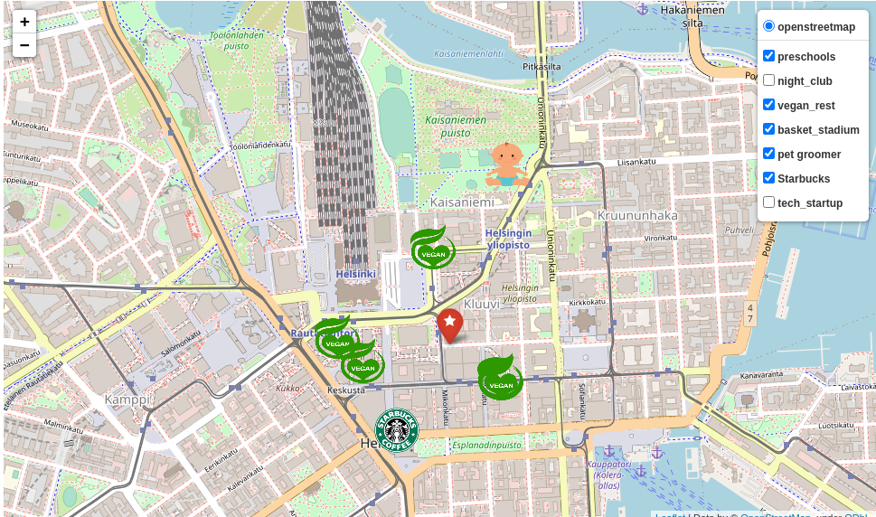
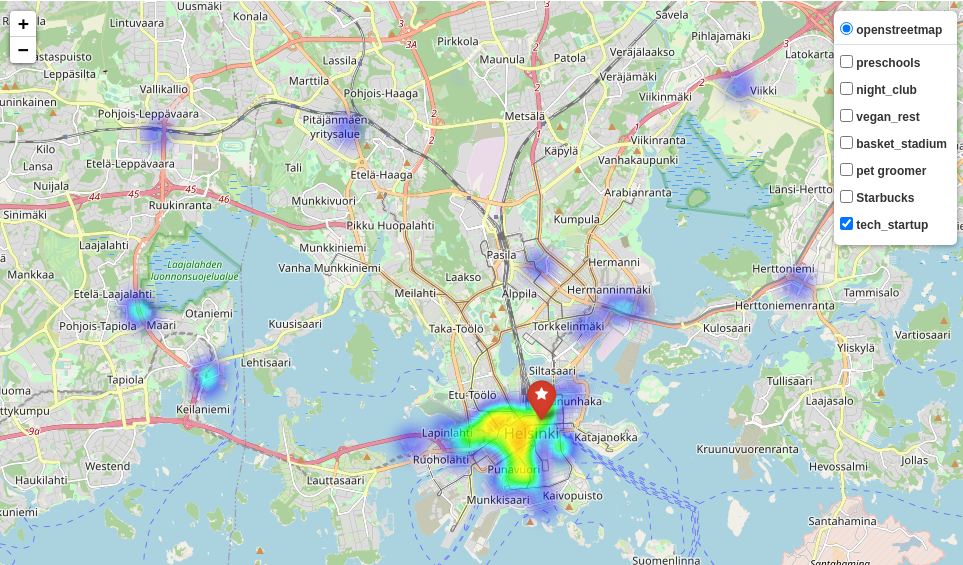

 

# GeoSpatial Data Project. 
# Finding the Best Office venue for a Gaming Company.

 

The scope of [this Ironhack project](https://github.com/sgonzalainen/datamad1020-rev/tree/master/projects/W4-geospatial-data-project) is to find a proper office location for a Gaming company given a set of employees with a list of nice-to-haves. The final output shall be a pair of **coordinates** (latitude, longitude).

## Introduction

I've lived in Helsinki (Finland) for 5 years and the Finnish Gaming Industry is really booming lately over there. Ref [1](https://medium.com/the-shortcut/the-secret-of-the-successful-finnish-gaming-industry-d01792f8c1c)[2](https://www.helsinkitimes.fi/207-themes/player-one/16289-finland-still-a-gaming-superpower-in-2018.html#:~:text=The%20Finnish%20gaming%20industry%20is,global%20revenue%20of%2035%20billion.).

Who does not know [*Angry Birds*](https://en.wikipedia.org/wiki/Angry_Birds) or [*Clash of Clans*](https://en.wikipedia.org/wiki/Clash_of_Clans) ? They are video games produced by Finnish companies Rovio and Supercell, respectively.

So I decided to focus on Helsinki Area Region and try to find the best spot there.

## Description

As explained in the [project repo](https://github.com/sgonzalainen/datamad1020-rev/tree/master/projects/W4-geospatial-data-project), the dummy company would have the following scheme:

* 20 Designers
* 5 UI/UX Engineers
* 10 Frontend Developers
* 15 Data Engineers
* 5 Backend Developers
* 20 Account Managers
* 1 Maintenance guy that loves basketball
* 10 Executives
* 1 CEO/President

And these are the list of nice-to-haves:

* Designers like to go to design talks and share knowledge. There must be some nearby companies that also do design.
* 30% of the company staff have at least 1 child.
* Developers like to be near successful tech startups that have raised at least 1 Million dollars.
* Executives like Starbucks A LOT. Ensure there's a starbucks not too far.
* Account managers need to travel a lot.
* Everyone in the company is between 25 and 40, give them some place to go party.
* The CEO is vegan.
* If you want to make the maintenance guy happy, a basketball stadium must be around 10 Km.
* The office dog—"Pepe" needs a hairdresser every month. Ensure there's one not too far away.

## Approach

### Venues Search
First, I decided that I want to locate the brand new company in a **coworking space**. Therefore, I search in **Foursquare API** coworking spaces in Helsinki Area.

I have used **Foursquare API**, **Google Places API** and **Google Directions API** to get data related to venues near all the coworking spaces.

### Venues Scoring
In order to avoid any bias at selecting the place, each venue will get a score based on the fulfillment of the nice-to-haves requirements listed above. The selected spot will be the one with more points.

The rules for scoring is  as follows:
* Each employee/dog (from now on stakeholder) depending of its role have a personal value:
    * Ceo : 100 points
    * Executive: 50 points
    * Account Manager: 25 points
    * Whitecollar (i.e. Designer, Engineer, Developer): 15 points
    * Bluecollar (i.e. Maintenance guy): 10 points
    * Dog: 5 points

* Based on the nice-to-haves, if the spot fulfills with the stakeholder wish, the candidate gets the value of the stakeholder as score. 

* List of minimum requirements to get points:
    * At a max distance of 1 km, there must be at least one design company.
    * At a max distance of 500 m, there must be a at least one preschool/daycare.
    * Only 25% of candidates with higher number of tech start-ups at a distance of 1 km will get a score.
    * Travel time to airport is measured for a regular weekday(upcoming Tuesday 17 Nov 2020 used as reference) via **Google Maps API**. Ideal time is 20 min by car and 40 minutes by public transport. Each candidate will be penalized by 2% for each minute exceeding ideal values.
    * At a max distance of 500 m, there must be at least one night club.
    * At a max distance of 300 m, there must be at least one vegan restaurant.
    * At a max distance of 10 km, there must be at least one basketball stadium.
    * At a max distance of 800 m, there must be at least one pet groomer.
    * At a max distance of 300 m, there must be at least one Starbucks.

* Each stakeholder is an **Object class**. Employees which are parents are randomly choice.

# Result
The winner coworking space is [this](https://weareepicenter.com/helsinki/), located at Helsinki city center. For more details, check `report.ipynb` within `output` folder (in order to see properly interactive maps, you can see the rendered [here](https://nbviewer.jupyter.org/github/sgonzalainen/IronHack-Project4-GeoSpatialProject/blob/main/main.ipynb)).

Examples of maps generated(here as image):

## Repo Structure

 `main.ipynb` : notebook where all work has been done.

 `data/` : folder containing csv files of all candidates, helsinki places and scoring.

 `src/` : folder with  .py files containing auxiliary functions used in main.ipynb . In addition,  `variables.py` contains all the config variables, for example distance required for vegan restaurants. So that it can be easily changed in future if needed.

  `output/` : folder containing a final report in a jupyter notebook along with the folium maps generated in main.ipynb.

  ## Further developments

* Develop more functionalities into folium maps.

## Technologies and Environment

Python3 on Ubuntu 20.04

### Data Collection
* __[Foursquare API](https://developer.foursquare.com/docs/places-api/)__
* __[Google Places API](https://developers.google.com/places/web-service/overview)__ 
* __[Google Directions API](https://developers.google.com/maps/documentation/directions/overview)__

### Scoring
* __[Pymongo](https://pypi.org/project/pymongo/)__ : for Mongo Geoqueries.
* __[Geopy](https://pypi.org/project/geopy/)__  : for distances.

### Plotting
* __[Folium](https://pypi.org/project/folium/)__ 

